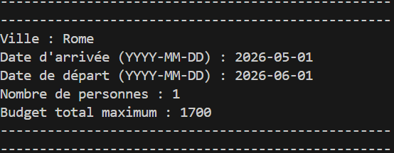
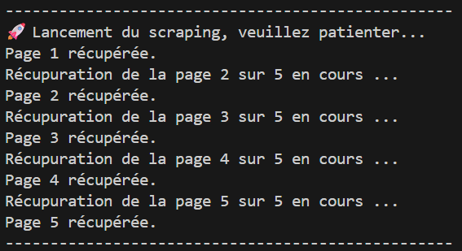
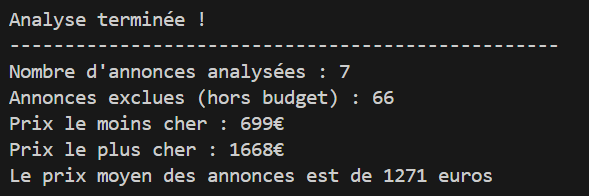
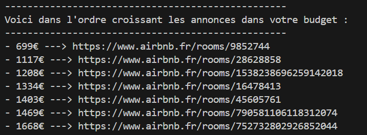

# 🏠 Airbnb Scraper
A Python Web Scraping tool that analyzes Airbnb listings and filters them according to a defined budget.
Then returns direct links to the best deals, sorted from cheapest to most expensive.

---

## 📸 Preview

### User inputs :


### Scraping in progress :


### Results :


### Listings within budget :



---

## ✨ Features
- Scrapes the first X pages of Airbnb results (default: 5 pages)
- Filters listings by a maximum budget
- Displays statistics (average, min, max price and number of listings)
- Lists direct links to listings within budget, sorted from cheapest to most expensive
- Input validation (date format, positive budget, non-empty city)
- Handles special characters in city names (São Paulo, Île-de-France...)
- Delay between pages to avoid being blocked

---

## 🧠 Skills demonstrated
- **Web scraping** of JavaScript-rendered dynamic pages
- **Playwright** — headless browser automation, automatic pagination, selector waiting
- **BeautifulSoup** — HTML parsing and data extraction
- **Error handling** — timeouts, invalid inputs, missing pages
- **Git** — version control and regular commits
- **Python** — functions, type hints, logging, regular expressions

---

## 🛠️ Installation

### 1. Clone the repository
```bash
git clone https://github.com/your-username/airbnb-scraper.git
cd airbnb-scraper
```

### 2. Install Python dependencies
```bash
pip install -r requirements.txt
```

### 3. Install Playwright and Chromium
```bash
playwright install chromium
```

---

## 🚀 Usage
```bash
python main.py
```

The script will ask the following questions:

| Question | Example |
|----------|---------|
| City | `Bangkok` |
| Check-in date | `2026-04-01` |
| Check-out date | `2026-05-01` |
| Number of guests | `1` |
| Maximum budget (€) | `1200` |

---

## 📦 Dependencies

| Package | Usage |
|---------|-------|
| `playwright` | Headless browser to scrape JavaScript-rendered pages |
| `beautifulsoup4` | HTML parsing to extract prices and links |

---

## ⚠️ Disclaimer
This project is for personal and educational use only. Heavy usage may result in a temporary IP ban from Airbnb. Use responsibly.
